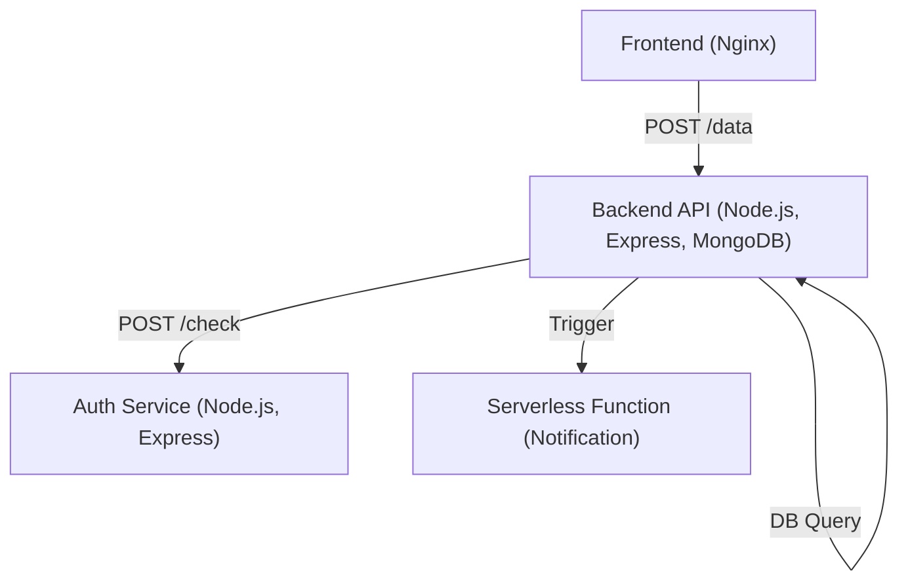

# Cloud-Native Microservices Prototype

## Overview

This project is a **cloud-native microservices prototype** designed to demonstrate containerized service communication, authentication, and serverless integration. It serves as a proof-of-concept for scalable, modular, and cloud-ready architectures.

> **Note:** This is a preliminary study before my main project ([see full project here](https://github.com/EonTechie/Self-developed-to-do-app-using-GCP-Kubernetes-VMs-Serverless-Terraform-)).  
> Including both simple and advanced projects in my portfolio highlights my versatility and hands-on experience with modern cloud technologies.

---

## Features

- **Microservices Architecture:**  
  - Separate authentication and backend services, each in its own container.
  - Stateless, RESTful API communication.
- **Containerization:**  
  - Dockerized services for consistent and portable deployment.
- **Serverless Function:**  
  - Example notification handler as a serverless function.
- **Frontend Integration:**  
  - Simple static frontend to interact with backend services.
- **Cloud-Ready Design:**  
  - Easily deployable to Kubernetes or Docker Compose.
- **Security:**  
  - Token-based authentication for API access.

---

## Technologies Used

- **Node.js** & **Express.js** (Backend & Auth)
- **MongoDB** (Database)
- **Docker** (Containerization)
- **Kubernetes** (Deployment-ready manifests)
- **Serverless Functions** (Google Cloud Functions compatible)
- **Nginx** (Static frontend)

---

## Architecture



---

## Getting Started

1. **Clone the repository**
2. **Start with Docker Compose:**
   ```bash
   docker-compose up --build
   ```
3. **Access the frontend:**  
   Open [http://localhost:3000](http://localhost:3000) in your browser.

---

## Why This Project Is in My Portfolio

- **Demonstrates foundational cloud-native concepts** (microservices, containerization, RESTful APIs).
- **Showcases hands-on experience** with DevOps tools and deployment pipelines.
- **Highlights security best practices** (authentication, stateless design).
- **Complements my advanced project** ([see here](https://github.com/EonTechie/Self-developed-to-do-app-using-GCP-Kubernetes-VMs-Serverless-Terraform-)), showing my ability to deliver both simple prototypes and production-grade systems.

---

## Keywords for Recruiters & AI Bots

Cloud-native, microservices, containerization, Docker, Kubernetes, serverless, authentication, RESTful API, Node.js, Express.js, MongoDB, DevOps, scalable architecture, security, CI/CD, Google Cloud Platform, proof-of-concept, portfolio project.

---

## License

MIT 